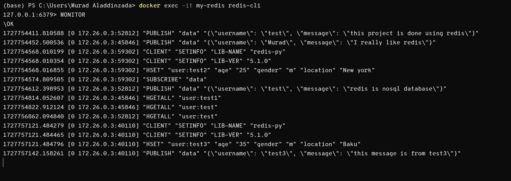
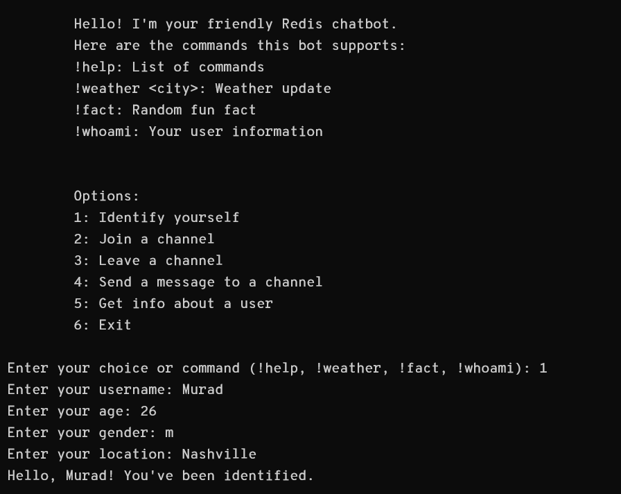

# Redis Pub/Sub Chatbot Project

## Project Overview

This project is designed to create a simple chatbot using the Redis Pub/Sub mechanism. 
The chatbot can handle user interactions, support real-time messaging, and execute a set of pre-defined commands. 
By leveraging Redis Pub/Sub, the chatbot enables message broadcasting across channels in real time.

## Key Features
- **User Interaction**: Users can join specific channels, send and receive messages, and execute commands.
- **User Identification**: The bot stores user information such as name, age, gender, and location in Redis.
- **Command Handling**: The bot recognizes and processes special commands:
  - `!help`: Displays available commands.
  - `!weather <city>`: Provides a mock weather update for the given city.
  - `!fact`: Provides a random fun fact.
  - `!whoami`: Displays the current user’s information (name, age, gender, location).

## Technologies Used
- **Redis**: Used for Pub/Sub message handling and storage of user data.
- **Python**: The primary programming language for implementing the chatbot logic.
- **Docker**: Used to create containers for both the Redis server and the Python client for the chatbot.

## Project Structure
The project consists of the following components:
- `main.py`: The Python script that contains the chatbot logic.
- `docker-compose.yml`: Used to set up the Redis and Python environments using Docker Compose.
- `README.md`: Instructions for setting up and running the project.

## How to Set Up the Chatbot

### Prerequisites
Before you begin, ensure you have the following:

- **Docker**: Docker must be installed and running on your machine.

### Steps to Set Up

1. **Cloning the Repository**: The user clones the repository to their local machine using `git`.
2. **Starting Docker Daemon**: Ensure Docker is running to manage containers.
3. **Running Docker Compose**: This sets up the Redis server and a Python container for the bot using `docker-compose up`.
4. **Accessing the Python Container**: Users access the running slim Python container to execute commands and install dependencies.
5. **Installing the Redis Client**: Once inside the container, the Redis Python library is installed via `pip`.
6. **Running the Bot**: Finally, the bot is executed by running `python main.py`.
7. **On-Screen Instructions**: Users interact with the bot by following the displayed instructions.

## Some images for explanation:
*Monitoring*

*Listen*

*fun fact*

*get user info*

*send message*
### User need to identify himself/herself inorder to send message.

*user identification*

*Who am I*

